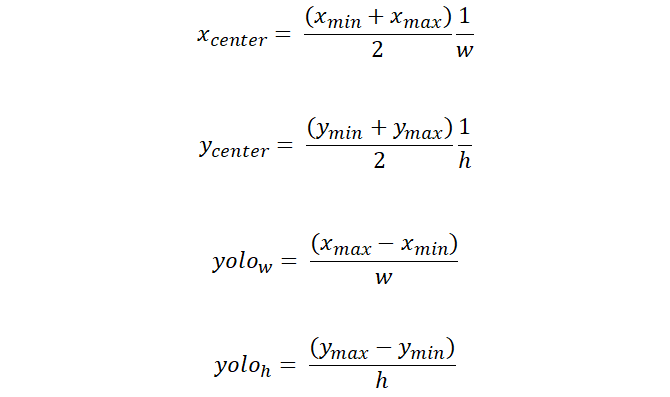

# yolov4-training
使用darknet執行訓練偵測模型

## 安裝相關套件
因有使用到absl套件進行command line參數的擷取，所以請先安裝此套件
``` bash
pip install absl-py
```
## 準備圖片素材
圖片來源

* [COCO](https://cocodataset.org/#download)
* [PASCAL VOC](https://cv.gluon.ai/build/examples_datasets/pascal_voc.html)
* [Open Images]()

這邊以COCO為例，下載2017 Train images[18G] & 2017 Train/Val annotations [241MB]，並解壓縮。
```bash
    # create folder
    mkdir coco_dataset
    # download annotations
    wget http://images.cocodataset.org/annotations/
    annotations_trainval2017.zip
    # download pictures
    wget http://images.cocodataset.org/zips/train2017.zip
    # unzip
    unzip train2017.zip
    unzip annotations_trainval2017.zip
```

## 從COCO圖片集中抽取目標類別圖片
因coco dataset具有90個類別圖片集，我們只需要抽取我們想要訓練的圖片集即可。
安裝相關套件
```bash
pip install pycoco
pip install lxml
pip install IPython
```

執行extract_classes.py，指定參數如下：

* source_path: coco圖片集的路徑
* output_path: 存放抽取出的圖片路徑
* class_list: 設定要抽取出的圖片集類別
```bash
python extract_classes.py -source_path the/source/path -output_path the/output/path -class_list person,car,motorcycle,bus,truck,licence
```

## 將XML標記轉換為YOLO格式
[標記圖檔格式說明](https://towardsdatascience.com/image-data-labelling-and-annotation-everything-you-need-to-know-86ede6c684b1)

yolo使用.txt來讀取要訓練用的標記格式，因此我們需要將xml轉換成yolo使用的格式。

Pascal VOC xml格式如下：
```
<annotation>
	<folder>images</folder>
	<filename>{FILENAME}</filename>
	<path>{PATH}</path>
	<source>
		<database>Unknown</database>
	</source>
	<size>
		<width>{WIDTH}</width>
		<height>{HEIGHT}</height>
		<depth>3</depth>
	</size>
	<segmented>0</segmented>
    <object>
		<name>{NAME}</name>
		<pose>Unspecified</pose>
		<truncated>0</truncated>
		<difficult>0</difficult>
		<bndbox>
			<xmin>{XMIN}</xmin>
			<ymin>{YMIN}</ymin>
			<xmax>{XMAX}</xmax>
			<ymax>{YMAX}</ymax>
		</bndbox>
	</object>
</annotation>
```
YOLO格式如下：
```
<object-class> <x> <y> <width> <height>
- x, y代表該bndBox的中心座標與圖片寬高的比值，是bndBox歸一化後的中心座標
- width, height代表該bndBox的寬高與輸入圖像寬高的比值，是bndBox歸一化後的寬高座標
```
因此Yolo 格式的公式如下圖，w, h是圖片本身的寬與高


執行transform_xml_to_txt.py，指定參數如下：

* source_path: coco圖片集的路徑，default: $pwd
* output_path: yolo .txt檔案&圖片檔的存放路徑，default: $pwd/yolo
* class_list: 設定要轉換的圖片集類別，default:person,car,motorcycle,bus,truck,licence
```
python transform_xml_to_txt.py -source_path ../coco_dataset/extracted_dataset/ -output_path ../coco_dataset/yolo -class_list person,car,motorcycle,bus,truck,licence 
```
完成此步驟後，會將yolo訓練所需要的圖片檔與txt檔放置在ouput_path的路徑下

## 建立訓練所需的設定檔
執行create_yolo_cfg.py，指定參數如下：

* img_path: 要訓練圖片的路徑，default: $pwd
* cfg_path: 存放yolo config的路徑，default: $pwd/yolo_cfg
* total_classes: 總共有幾個類別要訓練，default: 6
* tiny: 是否使用tiny版本的yolov4 config，default: false

```
python create_yolo_cfg.py -img_path ../coco_dataset/yolo/ -cfg_path ../coco_dataset/yolo_cfg/ -total_classes 6
```
完成此步驟後，cfg_path路徑下將會有下列檔案：
* obj.data
* obj.names
* test.txt
* train.txt
* yolov4.cfg
## anchors數值的修改
因為預設cfg中anchors的數值是使用 coco datasets 計算出來的，在訓練自己的資料集時不一定適用，因此需要使用 calc_anchors 來計算出適合自己 datasets 的 anchors。
參數num_of_clusters在非tiny模組設定為9，如果是tiny模組則設定為6。
利用darknet執行如下命令：
```
./darknet detector calc_anchors ../coco_dataset/yolo_cfg/obj.data -num_of_clusters 9 -width 416 -height 416 -showpause
```
計算後的數值將會顯示在console並且寫入anchors.txt。如果要將此數值套用至yolov4.cfg中，可以再執行一次create_yolo_cfg.py
## 開始訓練
在darknet資料夾下，根據需求下載預訓練模型：

	wget https://github.com/AlexeyAB/darknet/releases/download/darknet_yolo_v3_optimal/yolov4.conv.137

接著執行訓練的命令：
```
./darknet detector train ../coco_dataset/yolo_cfg/obj.data(obj.data檔的path) ../coco_dataset/yolo_cfg/yolov4.cfg(yolov4.cfg檔的path) yolov4.conv.137(預訓練模型路徑) -map
```
如果發生記憶體不足而發生當機問題時，可以嘗試調整yolov4.cfg檔案中的參數。
* width, height調小，預設為416，此數值須為32的倍數。
* subdivisions數值調大，預設為16，可調大為32, 64。mini_batch = batch/subdivisions，而 mini_batch 才是實際送進去訓練的 batch

如果要從上次訓練的結果接續訓練可以執行命令：
```
./darknet detector train ../coco_dataset/yolo_cfg/obj.data(obj.data檔的path) ../coco_dataset/yolo_cfg/yolov4.cfg(yolov4.cfg檔的path) ../coco_dataset/yolo_cfg/weights/yolov4_last.weights(上次訓練的模型路徑) -map
```
訓練完成後會在weights目錄下產生yolov4_final.weights，使用新的模型檔進行辨識，執行命令如下:

```
./darknet detector test ../coco_dataset/yolo_cfg/obj.data ../coco_dataset/yolo_cfg/yolov4.cfg ../coco_dataset/yolo_cfg/weights/yolov4_final.weights data/person.jpg(被偵測圖片路徑)

./darknet detector demo ../coco_dataset/yolo_cfg/obj.data ../coco_dataset/yolo_cfg/yolov4.cfg ../coco_dataset/yolo_cfg/weights/yolov4_final.weights test.mp4(被偵測影片路徑) -out_filename rosio.avi
```
## Reference
* https://aiacademy.tw/yolo-v4-intro/
* https://yanwei-liu.medium.com/python%E5%BD%B1%E5%83%8F%E8%BE%A8%E8%AD%98%E7%AD%86%E8%A8%98-%E4%B9%9D%E4%B9%8B%E4%B8%89-yolov3%E7%B5%90%E5%90%88%E6%B7%B1%E5%BA%A6%E5%AD%B8%E7%BF%92%E7%9A%84object-detector-65440b54422b