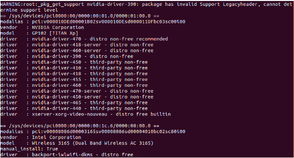
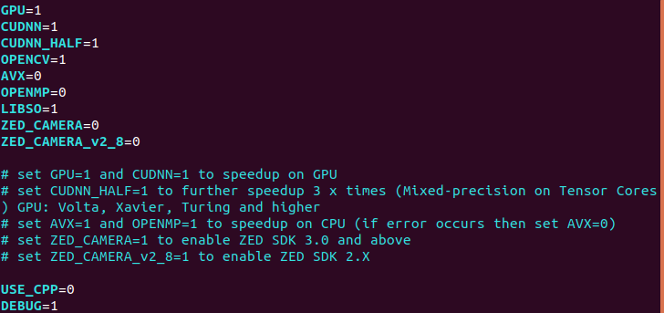

## 測試環境
* OS: Ubuntu 18.04
* GPU: Nvidia TITAN Xp
* CPU: Intel i7-8086K 4GHz
* RAM: 32G

## GPU driver安裝
```bash
sudo apt-get update
sudo apt-get install -y ubuntu-drivers-common
ubuntu-drivers devices
```
執行ubuntu-drivers devices後，系統會顯示建議值，如下圖所示為nvidia-driver-470。



接著執行
```
sudo ubuntu-drivers autoinstall
```
因為nvidia driver在linux kernel版本更新後，無法自行更新。因此可能遇到
* 無法開機的狀況(因為GUI介面無法正常啟動)。
* 無法執行nvidia-smi
此時可以使用使用進階開機模式，使用上一個版本的kernel進入系統後，將nvidia driver移除。
```bash
sudo apt clean
sudo apt purge *nvidia-.*
sudo apt autoremove
```
接著可以執行,確定nvidia相關的library都已被移除
```
dpkg -l '*nvidia*'
```
重新開機後應該可以正常進入GUI介面，再重新安裝nvidia driver。
參考[連結](https://transang.me/how-to-reinstall-nvidia-driver-after-a-linux-kernel-upgrade/)

## 安裝相關軟體
1. CMake >= 3.12
    ``` bash
    apt install cmake
    ```
2. CUDA >=10.0 (For GPU)

    參考Nvidia[官網](https://docs.nvidia.com/cuda/cuda-installation-guide-linux/index.html)的安裝步驟
3. cuDNN >= 7.0 for CUDA 10.0 (for GPU)

    參考Nvidia[官網](https://docs.nvidia.com/deeplearning/cudnn/install-guide/index.html)的安裝步驟
4. OpenCV >= 2.4 (For CPU and GPU)
    ``` bash
    apt install libopencv-dev python3-opencv
    ```
5. Other Dependencies: make, git, g++
    ``` bash
    apt install make git g++
    ```
## 測試YOLOv4
1. 下載source code
    ```bash
    git clone https://github.com/AlexeyAB/darknet.git
    ```
2. 修改makefile相關參數如下圖所示，enable GPU的設定後進行編譯。

    

    這裡有一個地方需要注意，make file中預設nvcc使用的是系統路徑下(/usr/bin/nvcc)的而非我們自行安裝的。因此需要修改Line77變更路徑。
    ```
    NVCC=/usr/local/cuda-11.4/bin/nvcc
    ```
3. 執行make
4. 下載預訓練權重檔
    ```bash
    wget https://github.com/AlexeyAB/darknet/releases/download/darknet_yolo_v3_optimal/yolov4.weights
    ```
5. 測試圖片
    ``` bash
    ./darknet detector test cfg/coco.data cfg/yolov4.cfg yolov4.weights data/person.jpg
    ```
6. 測試影片，自行下載想要辨識的影片，執行如下的命令，可使用參數-out_filename來指定輸出辨識後的影片檔名。
    ``` bash
    ./darknet detector demo cfg/coco.data cfg/yolov4.cfg yolov4.weights test.mp4 -out_filename rosio.avi
    ```